# Temporizador Pomodoro - Aplicación Angular

## Resumen del Proyecto

Esta aplicación es un temporizador Pomodoro desarrollado con Angular 19 y Material Design 19, implementando la técnica de productividad Pomodoro con un diseño minimalista y funcional. La aplicación permite gestionar sesiones de trabajo y descanso con configuraciones personalizables, notificaciones del sistema y persistencia de estado.

## Características Principales

- **Configuración flexible**: Personalización completa de tiempos y comportamientos
- **Notificaciones nativas**: Sistema robusto de notificaciones del navegador
- **Persistencia de estado**: Conserva el progreso entre sesiones del navegador
- **Responsive design**: Optimizado para diferentes dispositivos
- **Progreso visual**: Indicadores claros del avance de las sesiones

## Arquitectura del Proyecto

### Estructura de Carpetas

```
src/
├── app/
│   ├── components/           # Componentes de la interfaz
│   │   ├── configuration/    # Modal de configuración con stepper
│   │   ├── floating-indicator/ # Indicador flotante compacto
│   │   ├── main-dialog/      # Diálogo principal contenedor
│   │   └── session-view/     # Vista principal del temporizador
│   ├── models/              # Modelos de datos TypeScript
│   │   ├── pomodoro-config.model.ts
│   │   └── pomodoro-session.model.ts
│   └── services/            # Servicios de la aplicación
│       ├── pomodoro.ts      # Lógica principal del temporizador
│       └── storage.ts       # Persistencia en localStorage
└── styles.scss              # Estilos globales minimalistas
```

## Tecnologías Utilizadas

- **Angular 19**: Framework principal con Standalone Components
- **Material Design 19**: Sistema de componentes UI
- **TypeScript 5.6**: Desarrollo con tipado estático
- **RxJS**: Programación reactiva para el timer
- **SCSS**: Preprocesador CSS para estilos organizados
- **Signals**: Nueva API de reactividad de Angular

## Flujo de Usuario Principal

1. **Inicialización**: La aplicación solicita permisos de notificación
2. **Configuración inicial**: El usuario puede personalizar tiempos y comportamientos
3. **Inicio de sesión**: Comienza el primer pomodoro de trabajo
4. **Progresión automática**: Transición inteligente entre trabajo y descansos
5. **Notificaciones contextuales**: Información en tiempo real del progreso
6. **Persistencia**: El estado se conserva entre sesiones del navegador

## Funcionalidades por Componente

### 1. Vista Principal del Temporizador (session-view)

La vista principal muestra el estado actual del temporizador con:
- **Timer principal**: Visualización del tiempo restante en formato MM:SS
- **Barra de progreso**: Indicador visual del avance de la sesión
- **Información de contexto**: Tipo de sesión actual y objetivo
- **Controles principales**: Botones para iniciar, pausar, reiniciar y saltar sesión

**Modal por defecto**
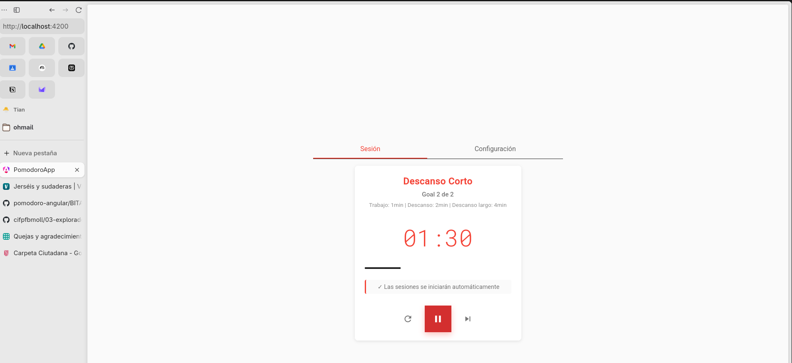  

Una vez iniciada la sesion de trabajo el modal dejará de ser visible y pasará a modo compacto para que funcione como una app en "segund plano" con las notificaciones de sistema activadas y en curso. Es decir hay un manejo de estados.  

1. **IDLE**: Estado inicial, esperando inicio
2. **RUNNING**: Sesión activa con timer en marcha
3. **PAUSED**: Sesión pausada, mantiene progreso
4. **COMPLETED**: Sesión finalizada, listo para transición


**Sesión Iniciada:**
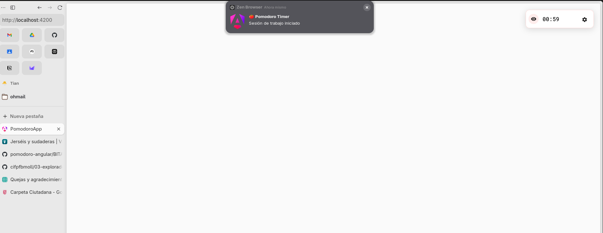

**Sesión Completada:**
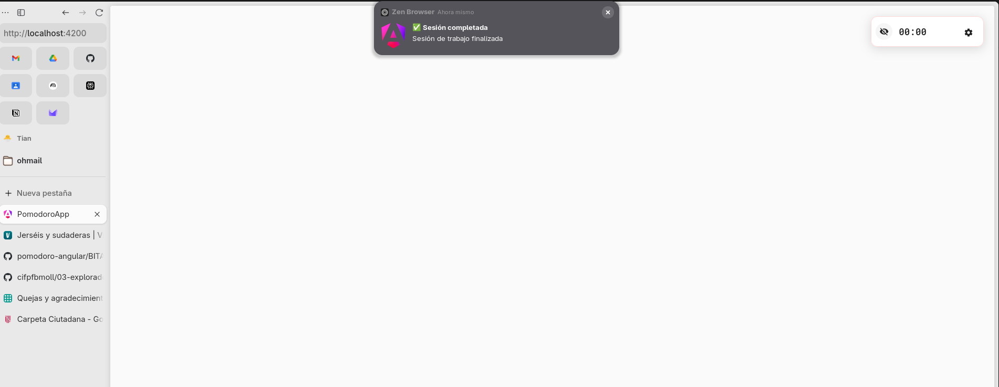

**Descanso Corto:**
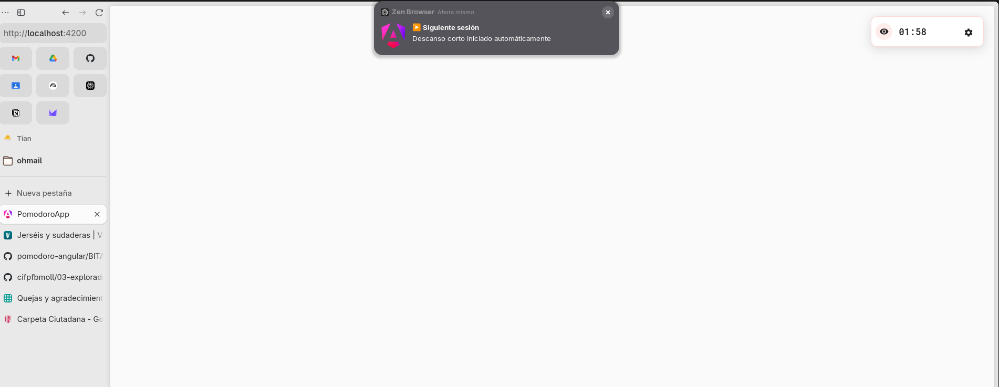

Características técnicas:
- Actualización en tiempo real cada segundo
- Transiciones automáticas entre sesiones
- Cambio de color según el tipo de sesión
- Gestión de estados (idle, running, paused, completed)

### 2. Configuración Avanzada (configuration)

Sistema de configuración implementado con Material Stepper de 3 pasos:

#### Paso 1: Numero de sesiones de estuido "Goals"  
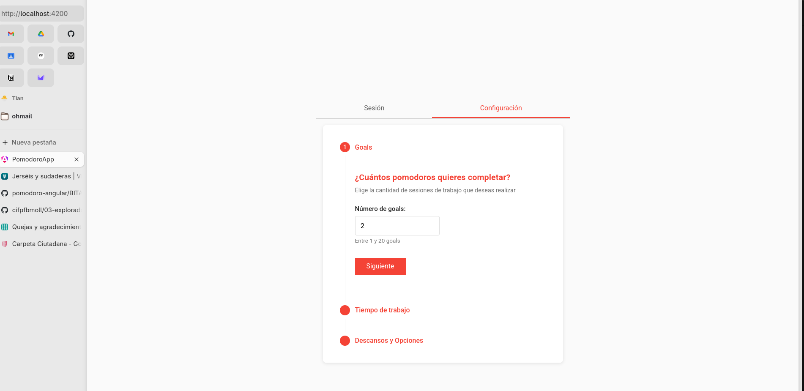)

#### Paso 1: Duración de Sesiones
- Configuración de tiempo de trabajo (1-60 minutos)
- Validación en tiempo real
- Valores por defecto optimizados

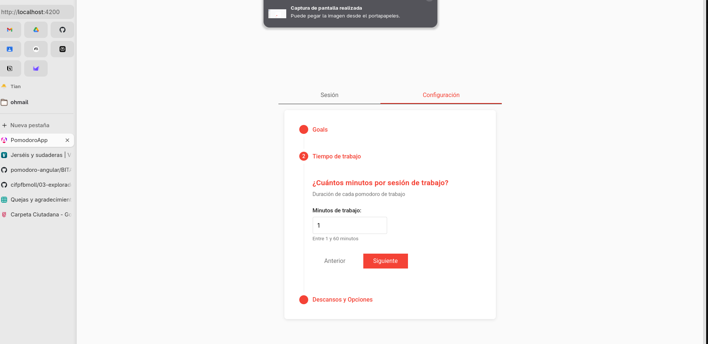

#### Paso 2: Configuración de Descansos
- Duración del descanso corto (1-60 minutos)
- Duración del descanso largo (1-60 minutos)
- Número de sesiones hasta descanso largo

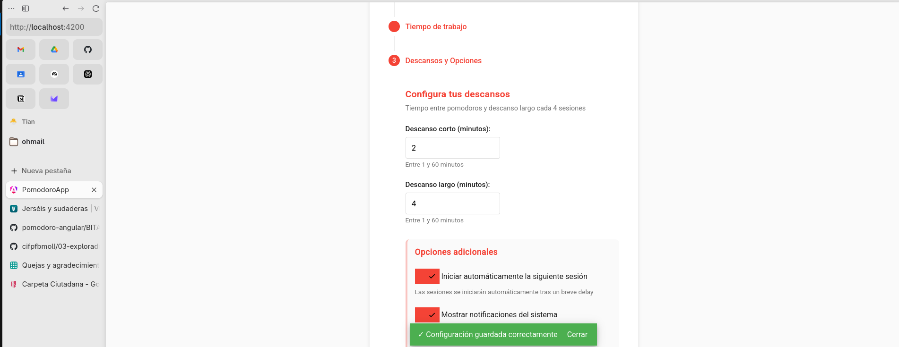

#### Paso 3: Guardar configuración
- Toggle para inicio automático de siguientes sesiones
- Activación/desactivación de notificaciones del sistema
- Configuración del número total de objetivos

**Confirmación de Guardado:**
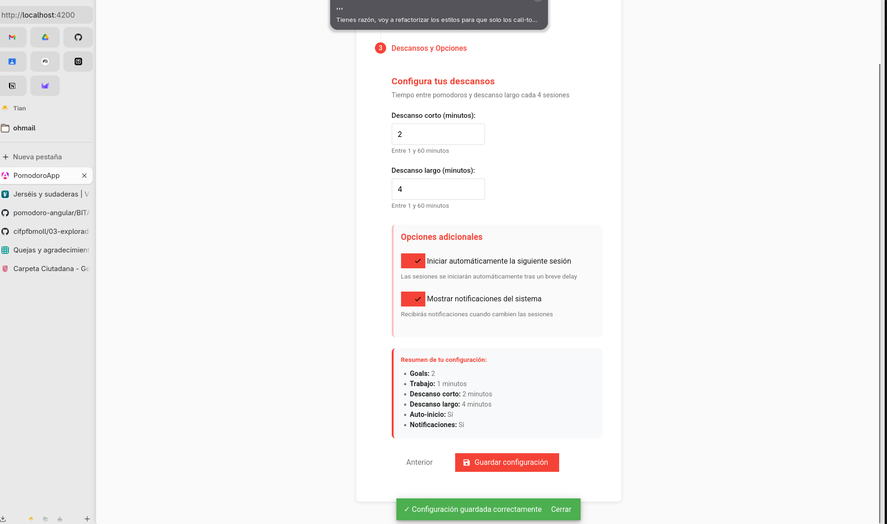

Características técnicas:
- Formulario reactivo con validación
- Persistencia automática de configuración
- Feedback visual con toasts de confirmación
- Navegación no lineal entre pasos

### 3. Vista Compacta (floating-indicator)  
Como antes se indicó una vez iniciada o configurada y despues iniciada la sesion a cumplir la app pasa a modo compacto para que no moleste mostrando informacion minima si se quiere desplegar el modal de nuevo se debe activar el icono de condiguración


- **Indicador flotante**: Muestra tiempo restante de forma discreta
- **Expansión bajo demanda**: Se abre el modal completo al hacer clic
- **Persistencia visual**: Mantiene información esencial siempre visible

**Vista Compacta Inicial:**
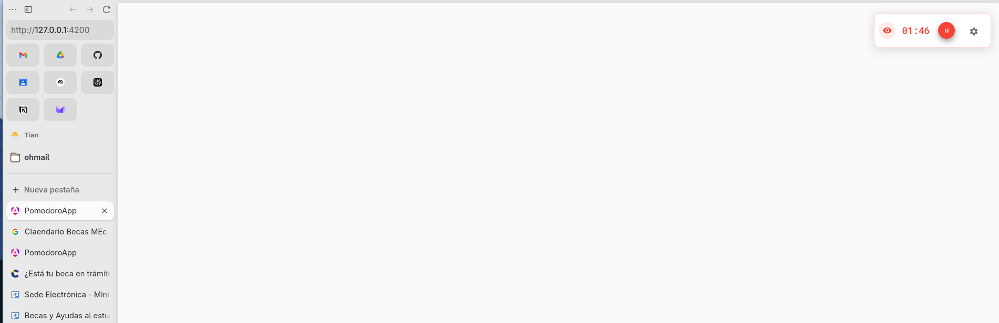

**Despliegue del Modal:**
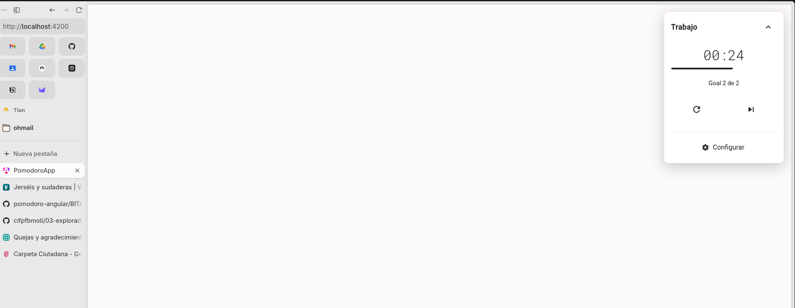

### 4. Modal Principal (main-dialog)

Contenedor principal que gestiona la presentación:
- **Diseño responsivo**: Se adapta a diferentes tamaños de pantalla
- **Navegación entre vistas**: Alterna entre timer y configuración
- **Gestión de estado**: Coordina la comunicación entre componentes

**Modal Pomodoro Abierto:**


**Estado Post-Configuración:**
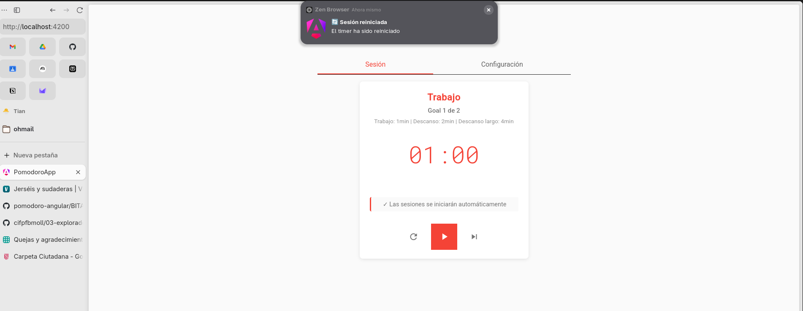

## Servicios y Lógica de Negocio

### PomodoroService

Servicio principal que implementa toda la lógica del temporizador:

**Características principales**:
- **Signals de Angular**: Reactividad moderna con computed properties
- **Gestión de tiempo**: Timer preciso con interval de RxJS
- **Transiciones automáticas**: Cambio inteligente entre trabajo y descansos
- **Notificaciones contextuales**: Diferentes mensajes según el evento
- **Persistencia de estado**: Guarda y restaura sesiones automáticamente

**Tipos de sesión manejados**:
- Sesión de trabajo (25 minutos por defecto)
- Descanso corto (5 minutos por defecto)
- Descanso largo (15 minutos por defecto)

### StorageService

Gestión de persistencia en localStorage:
- Configuración del usuario
- Estado actual de la sesión
- Progreso de objetivos completados

## Sistema de Notificaciones

Implementación robusta de notificaciones nativas del navegador:

**Notificaciones Habilitadas por Defecto:**
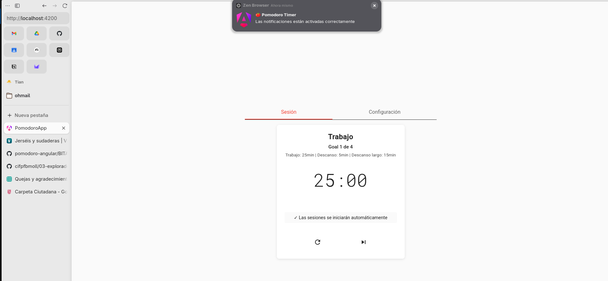

**Características**:
- **Solicitud de permisos**: Gestión automática al inicializar la aplicación
- **Notificaciones contextuales**: Diferentes mensajes para cada evento
- **Tags específicos**: Organización de notificaciones por tipo
- **Auto-cierre**: Cierre automático después de 5 segundos
- **Fallback graceful**: Funcionamiento sin notificaciones si no hay permisos

**Eventos notificados**:
- Inicio de sesión de trabajo
- Inicio de descansos
- Finalización de sesiones
- Pausa y reanudación
- Reinicio del temporizador
- Completar todos los objetivos

## Estados de Sesión


**Descanso Corto Finalizado:**
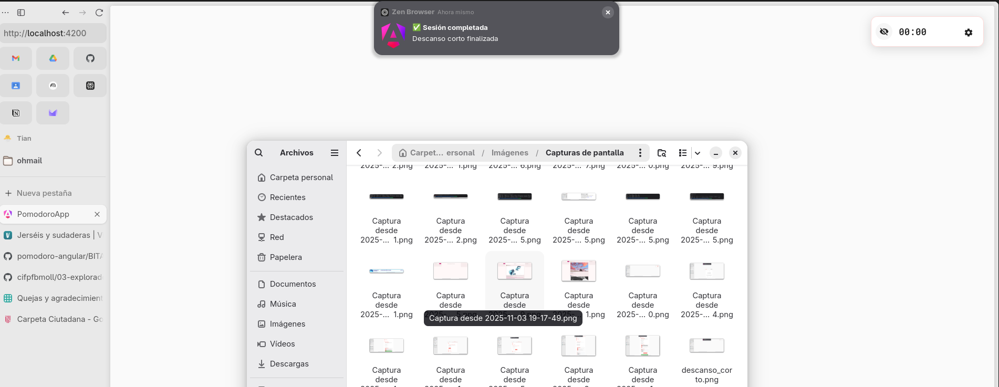


